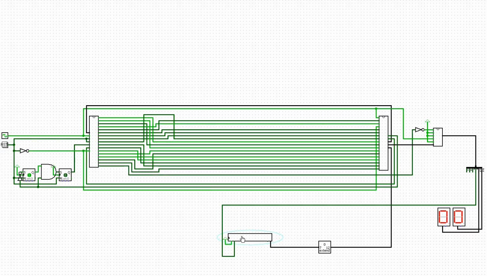

# BFComputer
 BFComputer is an architecture for running [Brainf*ck](https://en.wikipedia.org/wiki/Brainfuck) programs directly on hardware. It is a 12-bit computer using only 8 assembly instructions to manipulate memory, loop and interact with I/O.

| Instruction | Description                                                           |
| :---------: | --------------------------------------------------------------------- |
|    **+**    | Increment current cell value                                          |
|    **-**    | Decrement current cell value                                          |
|    **>**    | Increment cell cursor                                                 |
|    **<**    | Decrement cell cursor                                                 |
|    **[**    | If the current cell value is zero, jump to the associated `]`         |
|    **]**    | If the current cell value is nonzero, jump back to the associated `[` |
|    **.**    | Output the current cell value                                         |
|    **,**    | Write the input into the current cell value                           |

You can find in this repo the different parts of this project :
- The description of the hardware architecture, see [architecture (en) (not available yet)]() or [architecture (fr)](architecture/architecture_fr.md)
- The "compiler", from BF to binary (actually just a Python script converting the 8 instructions `+-<>[].,` to a binary value from 0 to 7)
- The microcode generator that describes the operations the computer has to run to execute the instructions. It is a C++ app that runs a Lua script where the description is.
- Logisim files that implements a simulation of the computer. Here's a screenshot:
  
	And the simulation running on [YouTube](https://www.youtube.com/watch?v=eYhoZPgXOwk)

I plan to build it in real, but I don't have the money and/or time to do so yet.

Some ressources that helped me getting interested in computer architecture and to design this one :
- Ben Eater video series : https://eater.net/8bit
- The Elements of Computing Systems book